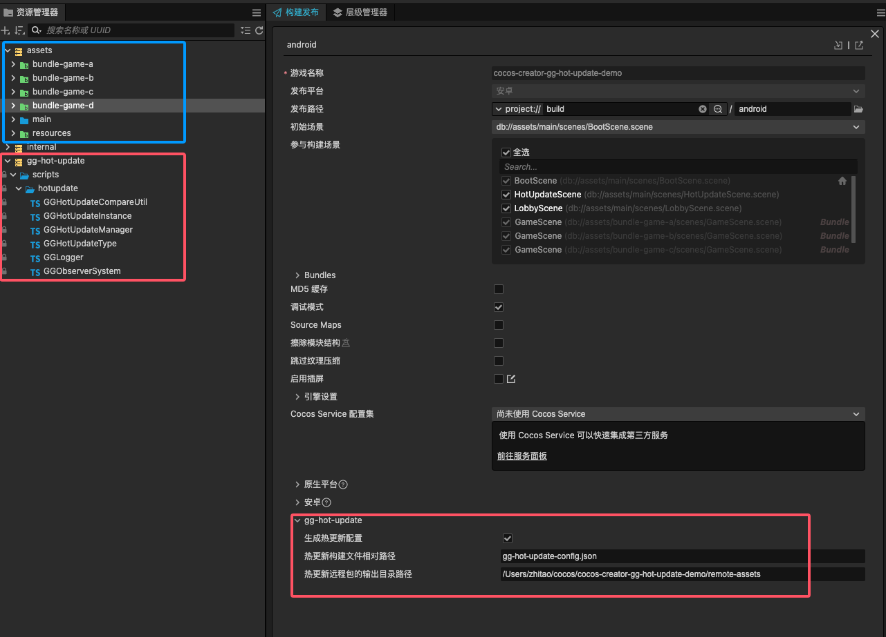

# cocos-creator-gg-hot-update-demo

一个 [gg-hot-update/热更新](https://store.cocos.com/app/detail/6756) 插件的Demo仓库

## 特别注意

1. **仓库仅包含插件的使用演示代码，不包含插件的源码，因此直接运行会报错**
2. **可以在购买插件前，查看此仓库的代码**
3. **在购买插件后，导入插件后，仓库就可以运行起来**

## 完整仓库资产预览



假设热更新需求如下：

1. 用户下载的 apk 包体体积尽可能小
2. 用户首次打开应用之后就热更新远程首包资源，同时远程首包资源必须包含 bundle-game-a 的游戏，方便快速打开此游戏
3. 其他子游戏（bundle-game-b、bundle-game-c、bundle-game-d）作为子包，单独热更新，在用户点击进入时才进行热更新

那么此时的热更新构建文件如下：

```
{
  "local_bundles": {
    "build-in": {
      "version": "0.0.0",
      "files": ["src/", "jsb-adapter/", "assets/internal/", "assets/main/", "assets/resources/"]
    }
  },
  "remote_bundles": {
    "build-in": {
      "version": "1.0.0",
      "files": ["src/", "jsb-adapter/", "assets/internal/", "assets/main/", "assets/resources/", "assets/bundle-game-a/"]
    },
    "bundle-game-b": {
      "version": "1.0.0",
      "files": ["assets/bundle-game-b/"]
    },
    "bundle-game-c": {
      "version": "1.0.0",
      "files": ["assets/bundle-game-c/"]
    },
    "bundle-game-d": {
      "version": "1.0.0",
      "files": ["assets/bundle-game-d/"]
    }
  }
}
```

对应实际运行演示如下：


演示解读：

- 首包必须热更新，热更新重启后才能进入大厅
- 进入 bundle-game-a 游戏不用热更新，因为此包是内置在远程首包中，在首包热更新下来时，已经包含了
- 进入 bundle-game-b 游戏需要热更新后才能进入
- 进入 bundle-game-c 游戏需要热更新后才能进入
- 进入 bundle-game-d 游戏需要热更新后才能进入
- 关闭应用，再次打开应用
- 首包会进行更新检查
- 进入 bundle-game-b/c/d 时，都会再次进行更新检查
