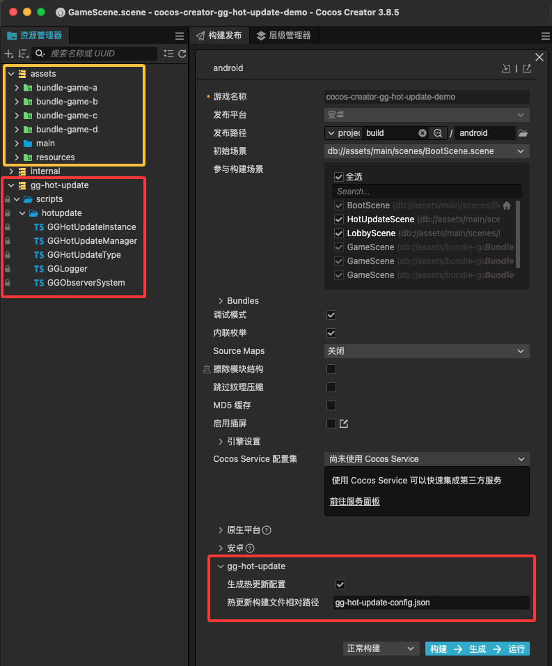

# cocos-creator-gg-hot-update-demo

[](./CHANGELOG.md)
[](http://www.cocos.com/creator)

> -   查阅 [插件论坛讨论地址](https://forum.cocos.org/t/topic/161655)
> -   查阅 [插件官方文档](https://www.yuque.com/dhunterstudio/mydoid/qshphh)
> -   查阅 [插件官方 demo](https://store.cocos.com/app/detail/6756)

一个 [gg-hot-update/热更新插件](https://store.cocos.com/app/detail/6756) 的 Demo 演示仓库

## 一、特别注意

1. **仓库仅包含插件的使用演示代码，不包含插件的源码，因此直接运行会报错**
2. **可以在购买插件前，查看此仓库的代码**
3. **在购买插件后，首次打开项目，导入插件后，关闭编辑器，然后重新启动编辑器，仓库就可以运行起来**

## 二、项目资产预览



## 三、项目演示的热更新需求

不同业务有着不一样的热更新需求，本项目演示的热更新需求如下:

1. 用户下载的 apk 包体体积尽可能小
2. 用户首次打开应用之后就热更新远程首包资源，同时远程首包资源必须包含 bundle-game-a 的游戏，方便快速打开此游戏
3. 其他子游戏（bundle-game-b、bundle-game-c、bundle-game-d）作为子包，单独热更新，在用户点击进入时才进行热更新

根据上述需求，热更包配置文件如下：

```
{
  "local_bundles": {
    "build-in": {
      "files": ["src/", "jsb-adapter/", "assets/internal/", "assets/main/", "assets/resources/"]
    }
  },
  "remote_bundles": {
    "build-in": {
      "files": ["src/", "jsb-adapter/", "assets/internal/", "assets/main/", "assets/resources/", "assets/bundle-game-a/"]
    },
    "bundle-game-b": {
      "files": ["assets/bundle-game-b/"]
    },
    "bundle-game-c": {
      "files": ["assets/bundle-game-c/"]
    },
    "bundle-game-d": {
      "files": ["assets/bundle-game-d/"]
    }
  }
}
```

对应实际运行演示如下：

https://github.com/user-attachments/assets/57ff6c46-df42-403b-a4b8-19b41dec5ab6

演示解读：

-   首包必须热更新，热更新重启后才能进入大厅
-   进入 bundle-game-a 游戏不用热更新，因为此包是内置在远程首包中，在首包热更新下来时，已经包含了
-   进入 bundle-game-b 游戏需要热更新后才能进入
-   进入 bundle-game-c 游戏需要热更新后才能进入
-   进入 bundle-game-d 游戏需要热更新后才能进入
-   关闭应用，再次打开应用
-   首包会进行更新检查
-   进入 bundle-game-b/c/d 时，都会再次进行更新检查
